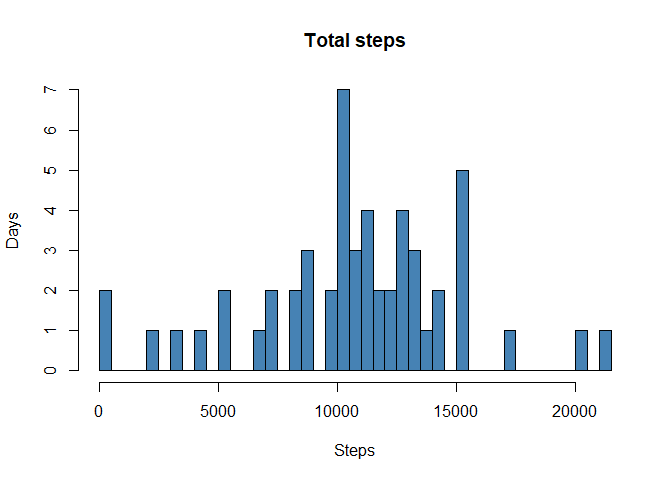
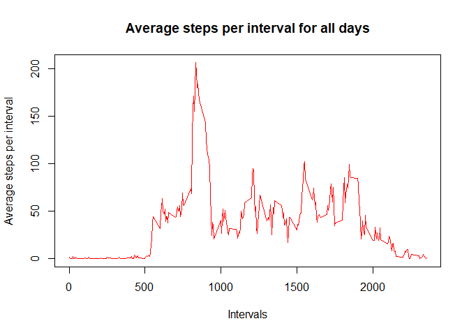
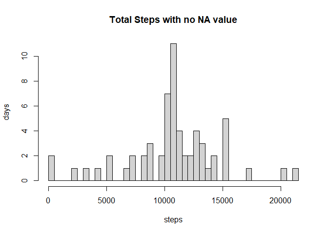
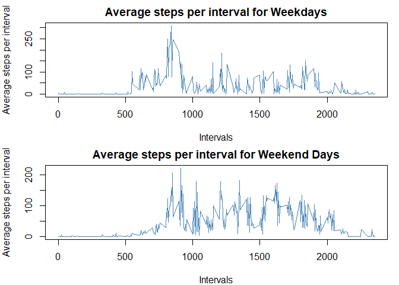

## Loading and preprocessing the data

#### Loading the data in r


```r
loaded_data <- read.csv("./repdata_data_activity/activity.csv")
```

#### Looking at the data to check what to do


```r
head(loaded_data)
```

```
##   steps       date interval
## 1    NA 2012-10-01        0
## 2    NA 2012-10-01        5
## 3    NA 2012-10-01       10
## 4    NA 2012-10-01       15
## 5    NA 2012-10-01       20
## 6    NA 2012-10-01       25
```

#### Lets check the class of the date column of the data set


```r
class(loaded_data$date)
```

```
## [1] "character"
```

#### We can see that it is in character format and we need to change it
#### to date format


```r
loaded_data$date <- as.Date(loaded_data$date, format = "%Y-%m-%d")
```

#### Checking the class of date now


```r
class(loaded_data$date)
```

```
## [1] "Date"
```

#### Great! Now lets see how many NA values are there in the available data


```r
sum(is.na(loaded_data$steps))
```

```
## [1] 2304
```

#### Removing these values and storing them in a new variable and seeing a few 
#### of those values


```r
no_na_data <- loaded_data[!is.na(loaded_data$steps),]
head(no_na_data)
```

```
##     steps       date interval
## 289     0 2012-10-02        0
## 290     0 2012-10-02        5
## 291     0 2012-10-02       10
## 292     0 2012-10-02       15
## 293     0 2012-10-02       20
## 294     0 2012-10-02       25
```

## What is mean total number of steps taken per day?

#### Taking the sum of daily steps taken and storing the 


```r
day_vise <- aggregate(steps ~ date, data = no_na_data, FUN = "sum")
```

#### Making a histogram of the total daily steps taken per day


```r
hist(day_vise$steps, main="Total steps", xlab="Steps", ylab="Days",
     col="steelblue", breaks = nrow(day_vise))
```

<!-- -->

#### Saving this histogram as a png file in figures folder


```r
png(filename = 'figures/plot1.png', width=480, height=480)
hist(day_vise$steps, main="Total steps", xlab="Steps", ylab="Days",
     col="steelblue", breaks = nrow(day_vise))
dev.off()
```

```
## png 
##   2
```

#### Calculating the mean and median of total number of steps taken daily


```r
mean(day_vise$steps)
```

```
## [1] 10766.19
```

```r
median(day_vise$steps)
```

```
## [1] 10765
```


## What is the average daily activity pattern?

#### Taking the the average number of taken per time interval and storing the
#### results in a variable named averages


```r
averages <- aggregate(steps ~ interval, data = no_na_data, FUN = "mean")
```

#### Plotting the averages of the 5 minute time intervals


```r
with(averages, plot(interval, steps, type = "l", xlab = "Intervals", 
                    ylab = "Average steps per interval", 
                    main = "Average steps per interval for all days",
                    col = "red"))
```

<!-- -->

#### Saving the plotted figure in figures folder as plot2


```r
png(filename = 'figures/plot2.png', width=480, height=480)
with(averages, plot(interval, steps, type = "l", xlab = "Intervals", 
                    ylab = "Average steps per interval", 
                    main = "Average steps per interval for all days",
                    col = "red"))
dev.off()
```

```
## png 
##   2
```

#### Getting the time interval which on average has the most number of steps 
#### across all days


```r
averages$interval[which.max(averages$steps)]
```

```
## [1] 835
```


## Imputing missing values

#### We have currently been working with the data set with no missing values,
#### but now we must input appropriate values in place of those NAs

#### To input the missing values in the given data set, we must first devise a
#### strategy as to how we will calculate the expected minimum values

#### At first lets take a look at the number of missing values and its percentage


```r
sum(is.na(loaded_data))
```

```
## [1] 2304
```

```r
mean(is.na(loaded_data))*100
```

```
## [1] 4.371585
```

#### To replace all the NA values, in this case I am using the average steps
#### per interval


```r
library("tidyverse")
```

```
## -- Attaching packages -------------------------------------------- tidyverse 1.3.0 --
```

```
## v ggplot2 3.3.2     v purrr   0.3.4
## v tibble  3.0.3     v dplyr   1.0.1
## v tidyr   1.1.1     v stringr 1.4.0
## v readr   1.3.1     v forcats 0.5.0
```

```
## -- Conflicts ----------------------------------------------- tidyverse_conflicts() --
## x dplyr::filter() masks stats::filter()
## x dplyr::lag()    masks stats::lag()
```

```r
merged_data <- merge(loaded_data, averages, by = "interval")
merged_data <- arrange(merged_data, date, interval)
merged_data$steps.x[is.na(merged_data$steps.x)] <- merged_data$steps.y
replaced_na <- merged_data[, c("interval", "steps.x", "date")]
colnames(replaced_na) <- c("interval", "steps", "date")
```

#### Now calculate the total number of new steps everyday and 
#### plotting a histogram


```r
total_steps <- aggregate(steps ~ date, data = replaced_na, FUN = "sum")
with(total_steps, hist(steps, main = "Total Steps with no NA value",
                       ylab = "days", xlab = "steps", 
                       breaks = nrow(total_steps)))
```

<!-- -->

#### Now storing this histogram in figures folder as plot3


```r
png(filename = "figures/plot3.png", width = 480, height = 480)
with(total_steps, hist(steps, main = "Total Steps with no NA value",
                       ylab = "days", xlab = "steps", 
                       breaks = nrow(total_steps)))
dev.off()
```

```
## png 
##   2
```

#### Calculating the mean and median of the new total number of daily steps


```r
mean(total_steps$steps)
```

```
## [1] 10766.19
```

```r
median(total_steps$steps)
```

```
## [1] 10766.19
```

#### Difference in the mean and median of the two data sets


```r
mean(total_steps$steps) - mean(day_vise$steps)
```

```
## [1] 0
```

```r
median(total_steps$steps) - median(day_vise$steps)
```

```
## [1] 1.188679
```

#### As we can see that there is no difference in the mean and only around
#### an increase of 1 in the median.
#### The basic reason for that is that we only replaced the NA values with the
#### mean values keeping the mean still the same and has a very little
#### impact on the median as well.

## Are there differences in activity patterns between weekdays and weekends?

#### To find the difference in the weekday and weekend data lets first store
#### these values in different variables


```r
replaced_na$weekday <- weekdays(replaced_na$date)
weekday_data <- replaced_na[replaced_na$weekday == c("Monday", "Tuesday", "Wednesday", "Thursday", "Friday"), ]
weekend_data <- replaced_na[replaced_na$weekday == c("Saturday", "Sunday"),]
mean_weekday <- aggregate(steps ~ interval , data = weekday_data, FUN = "mean")
mean_weekend <- aggregate(steps ~ interval , data = weekend_data, FUN = "mean")
```

#### Plotting the data to see the difference in the stats
#### of weekdays and weekends


```r
par(mfrow = c(2,1), mar = c(4,4,2,1))
with(mean_weekday, plot(interval, steps, type = "l", xlab = "Intervals", 
                    ylab = "Average steps per interval", 
                    main = "Average steps per interval for Weekdays",
                    col = "steelblue"))
with(mean_weekend, plot(interval, steps, type = "l", xlab = "Intervals", 
                    ylab = "Average steps per interval", 
                    main = "Average steps per interval for Weekend Days",
                    col = "steelblue"))
```

<!-- -->

#### Now saving the plot as plot4


```r
png(filename = "figures/plot4.png", width = 480, height = 480)
par(mfrow = c(2,1), mar = c(4,4,2,1))
with(mean_weekday, plot(interval, steps, type = "l", xlab = "Intervals", 
                    ylab = "Average steps per interval", 
                    main = "Average steps per interval for Weekdays",
                    col = "steelblue"))
with(mean_weekend, plot(interval, steps, type = "l", xlab = "Intervals", 
                    ylab = "Average steps per interval", 
                    main = "Average steps per interval for Weekend Days",
                    col = "steelblue"))
dev.off()
```

```
## png 
##   2
```
